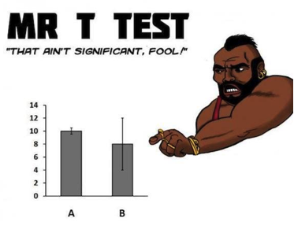

## Lab schedule

1/18: Introduction to R and R Studio, working with data\
1/25: Intro to Visualization\
**1/31: Probability, linear modeling**\
2/08: Data wrangling, model summaries\
2/15: Iteration\
2/22: Creating functions, debugging\
3/01: Simulation, Resampling\
3/15: Flex: more modeling (brms, glmmTMB)\
3/29: Spatial data or tidymodeling

## Review

```{=tex}
\begingroup
\fontsize{10}{11}\selectfont
```
```{r prompt=TRUE,comment='',collapse=TRUE,echo=FALSE,out.width="80%"}
suppressPackageStartupMessages(library(tidyverse))
library(gapminder)
gapdata <- gapminder %>% 
  filter(year >= 1990 & year <= 2007) %>% 
  group_by(continent)
ggplot(gapdata, aes(x = gdpPercap/1000,
                    y = lifeExp,
                    size = pop/1000000,
                    color = continent)) +
  geom_point(alpha = 0.5) +
  ylim(20,100) +
  labs(title = "Life Expectancy varies with GDP",
         subtitle = "1990 - 2007",
          x = "GDP per capita ($1000s)",
          y = "Life expectancy (yrs)",
         caption = "Plot created by @gavin_fay",
       size = "Population (M)",
       color = "Continent") +
  theme_minimal() 
```

```{=tex}
\endgroup
```

------------------------------------------------------------------------

```{=tex}
\begingroup
\fontsize{10}{11}\selectfont
```
```{r prompt=TRUE,comment='',collapse=TRUE,echo=TRUE,results='hide', fig.show='hide', out.width="80%"}
suppressPackageStartupMessages(library(tidyverse))
library(gapminder)
gapdata <- gapminder %>% 
  filter(year >= 1990 & year <= 2007) %>% 
  group_by(continent)
ggplot(gapdata, aes(x = gdpPercap/1000,
                    y = lifeExp,
                    size = pop/1000000,
                    color = continent)) +
  geom_point(alpha = 0.5) +
  ylim(20,100) +
  labs(title = "Life Expectancy varies with GDP",
         subtitle = "1990 - 2007",
          x = "GDP per capita ($1000s)",
          y = "Life expectancy (yrs)",
         caption = "Plot created by @gavin_fay",
       size = "Population (M)",
       color = "Continent") +
  theme_minimal() 
```

```{=tex}
\endgroup
```
## Recommended reading

An introduction to R (Venables et al.)\
-- <http://cran.r-project.org/doc/manuals/R-intro.pdf> - Today's material: Chapters 8, 11.

## Probability distributions in `R`

`R` includes a set of probability distributions that can be used to simulate and model data.

If the function for the probability model is named `xxx`

-   `pxxx`: the cumulative distribution $P(X \leq x)$\
-   `dxxx`: the probability distribution/density function $f(x)$\
-   `qxxx`: the quantile $q$, the smallest $x$ such that $P(X \leq x) > q$\
-   `rxxx`: generate a random variable from the model `xxx`

## Probability distributions in `R`


## Standard normal distribution

($\mu=0$, $\sigma^2=1$)

```{r prompt=TRUE,comment='',collapse=TRUE,echo=FALSE,results='hide',fig.height=3.25,fig.width=3.25}
plot(seq(-4,4,by=0.001),dnorm(seq(-4,4,by=0.001),0,1),xlim=c(-4,4),
xlab="",
ylab="",
ylim=c(0,0.45),yaxs="i",col="blue",type='l',lwd=3,
cex.lab=0.7,cex.axis=0.7,cex.main=0.7,
tcl=-0.25,mgp=c(1.5,0.25,0),
yaxp=c(0,0.4,4))
```

## Functions for normal distribution

Values of $x$ for different quantiles\
`qnorm(p, mean=0, sd=1, lower.tail=TRUE, log.p=FALSE)`

```{r prompt=TRUE,comment='',collapse=TRUE}
quants <- qnorm(c(0.01,0.025,0.05,0.95,0.975,0.99)) 
round(quants,2) 
```

$P(X \leq x)$\
`pnorm(q, mean=0, sd=1, lower.tail=TRUE, log.p=FALSE)`

```{r prompt=TRUE,comment='',collapse=TRUE,R.options=quants <- qnorm(c(0.01,0.025,0.05,0.95,0.975,0.99)) }
pnorm(quants) 
```

## Functions for normal distribution

Density (probability 'mass' per unit value of $x$)

```{r prompt=TRUE,comment='',collapse=TRUE,R.options=quants <- qnorm(c(0.01,0.025,0.05,0.95,0.975,0.99)) }
dnorm(quants, mean = 0, sd = 1)
```

Generating standard normal random variables

```{r prompt=TRUE,comment='',collapse=TRUE,R.options=quants <- qnorm(c(0.01,0.025,0.05,0.95,0.975,0.99)) }
rnorm(n=10, mean = 0, sd = 1)
```

<!-- ## Generating random numbers -->

<!-- Computers generate pseudorandom numbers using a sequence of specially chosen numbers and algorithms. -->

<!-- Each sequence of numbers starts at a random seed with values in `.Random.seed` -->

<!-- By default the random sequence is initialized based on the start time of the program. -->

<!-- For repeatable pseudorandom sequences first call `set.seed(seed)` with `seed =` any integer between -2147483648 $(-2^{31})$ and 2147483647 $(2^{31}-1)$. -->

## Generating random numbers

Often a good idea to use `set.seed()` and save the script detailing which number was used.

This ensures you can exactly repeat your results.

```{r prompt=TRUE,comment='',collapse=TRUE}
set.seed(42) 
rnorm(3) 
rnorm(3) 
set.seed(42) 
rnorm(3) 
rnorm(3) 
```

## The `sample()` function

```{=tex}
\begingroup
\fontsize{10}{11}\selectfont
```
To generate random numbers from discrete sets of values:\
- With or without replacement\
- Equal or weighted probability

Extremely useful function that underlies many modern statistical techniques:\
- Resampling\
- Bootstrapping\
- Markov-chain Monte-Carlo (MCMC)

e.g. Roll 10 dice

```{r prompt=TRUE,comment='',collapse=TRUE}
sample(1:6, size = 10, replace = TRUE)
```

Pick 3 species of bear

```{r prompt=TRUE,comment='',collapse=TRUE}
bears <- c("American Black", "Asian Black", "Brown", 
           "Panda", "Polar", "Sloth", "Spectacled", "Sun")
sample(bears, size = 3, replace = FALSE)
```

```{=tex}
\endgroup
```
## Lab Exercise 1/3

a.  Generate 1,000 random normal numbers with mean 24 and standard deviation 10. Find the proportion of those random numbers that are $\geq2$ standard deviations from the sample mean.\
b.  Flip a (fair) coin six times.\
c.  Find the probability of getting six heads on those six flips (i.e. $P(X=6)$ given $n=6$).\
d.  How much more likely is it to get three heads than six?\
e.  For a standard normal random variable, find the number $x$ such that $P(-x \leq X \leq x) = 0.24$.\
f.  The mean rate of arrival of alewives at a weir is 3.5 per hour. Plot the probability distribution function for the number of alewife arrivals in an hour.\
g.  Find the 95% confidence interval for the number of alewives arriving per day.

<!-- ## Basic statistical tests in `R` -->

<!-- LOTS of built-in functions to perform classical statistical tests. e.g.,\ -->
<!-- - Correlation `cor.test()`\ -->
<!-- - Chi-squared `chisq.test()`\ -->
<!-- - t-test `t.test()`\ -->
<!-- - F-test `var.test()`\ -->
<!-- - Analysis of Variance `anova()` -->

<!--  -->

## Linear models in `R`

Recall linear regression model:

$$y_i = \displaystyle\sum_{j=0}^{p}\beta_j x_{ij} + \varepsilon_i \text{ ,    } \varepsilon_i \sim N(0,\sigma^2) \text{ ,    } i=1,\dots,n$$

In matrix form: $y = X\beta + \varepsilon$

Model formulae in `R`, $y \sim x$, try `?formula`


## Linear models, `lm()`

The basic function for fitting ordinary multiple models is `lm()`

`fitted.model <- lm(formula, data = data.frame)`

e.g. species richness on beaches (Zuur Chapters 5 & 27)

```{r prompt=TRUE,comment='',collapse=TRUE, results='hide', message = FALSE}
RIKZ <- read_table(file = "../data/RIKZ.txt")
RIKZ <- RIKZ |>
  mutate(Richness = rowSums(RIKZ[,2:76]>0)) |>
  select(Richness, 77:89)
RIKZ_lm1 <- lm(Richness ~ NAP, data = RIKZ)
```

## Extracting model information

```{=tex}
\begingroup
\fontsize{10}{11}\selectfont
```
The value of `lm()` is a fitted model object.\
- a list of results of class `lm`.

Information about the fitted model can be extracted, displayed, plotted, using some generic functions, inlcuding:

-   `anova(object1,object2)` Compares a submodel with an outer model and produces an analysis of variance table
-   `coef(object)` Extract the regression coefficient\
-   `deviance(object)` Residual sum of squares\
-   `formula(object)` Extract the model formula\
-   `plot(object)` Produce four plots, showing residuals, fitted values and some diagnostics\
-   `predict(object, newdata=data.frame)` Model predictions on new data\
-   `residuals(object)` or `resid(object)` Extract the matrix of residuals\
-   `step(object)` forward or backward model selection using AIC\
-   `summary(object)` Print a comprehensive summary of the results\
-   `vcov(object)` Return variance-covariance matrix of main parameters

```{=tex}
\endgroup
```
## Summary objects

```{=tex}
\begingroup
\fontsize{10}{11}\selectfont
```
`summary(lm1)`

```{r prompt=TRUE,comment='',collapse=TRUE,echo=FALSE}
RIKZ_lm1 <- lm(Richness ~ NAP, data = RIKZ)
summary(RIKZ_lm1)
```

```{=tex}
\endgroup
```

## broom helper functions

```{=tex}
\begingroup
\fontsize{10}{11}\selectfont
```

`broom::tidy()`

```{r prompt=TRUE,comment='',collapse=TRUE,echo=TRUE}
library(broom)
tidy(RIKZ_lm1, conf.int = TRUE)
```

`broom::glance()`

```{r prompt=TRUE,comment='',collapse=TRUE,echo=TRUE}
glance(RIKZ_lm1)
```

```{=tex}
\endgroup
```

## {modelsummary}

The `{modelsummary}` package provides a wealth of options for creating publication-quality summary tables from fitted model objects, with bindings for most of the types of models we are using in this class.

There are lots of options....

```{r prompt=TRUE, collapse = TRUE, echo = TRUE, eval = FALSE}
library(modelsummary)
modelsummary(list(lm1 = RIKZ_lm1), 
             statistic = "conf.int",
             stars = TRUE)
```

<!-- modelsummary(list(lm1 = RIKZ_lm1, lm2 = RIKZ_lm2), statistic = "conf.int") -->

------------------------------------------------------------------------


<!-- ```{r echo = FALSE}
library(modelsummary)
modelsummary(list(lm1 = RIKZ_lm1), statistic = "conf.int", stars = TRUE)
``` -->


## Are model assumptions met?

In the MASS library there are many functions.

Are samples independent? (Sample design.)

Residuals normally distributed?\
- Histograms, qq-plots: qqplot() and qqline()\
- Kolmogorov-Smirnov normality test: ks.test()\
- Shapiro-Wilk normality test: shapiro.test()

Similar variance among samples?\
- Boxplots\
- Bartlett's test for equal variance: bartlett.test()\
- Fligner-Killeen test for equal variance: fligner.test()

## Checking assumptions

Model assumptions can be evaluated by plotting the model object.

```{r prompt=TRUE,comment='',collapse=TRUE,fig.width=2.5,fig.height=2.5,eval=FALSE}
plot(RIKZ_lm1)
# OR
library(gglm)
gglm(RIKZ_lm1)
```

------------------------------------------------------------------------

```{r prompt=TRUE,comment='',echo=TRUE,collapse=TRUE,R.options=library(gglm)}
gglm(RIKZ_lm1)
```

## Extracting model fit & residuals

`broom::augment()`

```{r prompt=TRUE,comment='',collapse=TRUE,echo=TRUE}
RIKZ_lm1_aug <- augment(RIKZ_lm1, se_fit = )
glimpse(RIKZ_lm1_aug)
```

## Extracting model fit & residuals

```{r prompt=TRUE,comment='',collapse=TRUE,echo=TRUE}
RIKZ_lm1_aug <- augment(RIKZ_lm1, 
                        se_fit = TRUE)
glimpse(RIKZ_lm1_aug)
```
## Extracting model fit & residuals

```{r prompt=TRUE,comment='',collapse=TRUE,echo=TRUE}
RIKZ_lm1_aug <- augment(RIKZ_lm1, 
                        interval = "confidence")
glimpse(RIKZ_lm1_aug)
```

## Extracting model fit & residuals

```{=tex}
\begingroup
\fontsize{10}{11}\selectfont
```

```{r prompt=TRUE,comment='',collapse=TRUE,echo=TRUE,out.width="80%"}
RIKZ_lm1_aug |>
  janitor::clean_names() |>
  ggplot() +
  aes(x = nap, y = fitted) +
  geom_line() + 
  geom_point(aes(x = nap, y= richness))
```

```{=tex}
\endgroup
```

## Fitting models directly on plots

```{r prompt=TRUE,comment='',collapse=TRUE,echo=TRUE,out.width="80%"}
ggplot(RIKZ, aes(x = NAP, y = Richness)) +
  geom_point() + 
  geom_smooth(method = "lm")
  
```

## Building and Comparing models

```{=tex}
\begingroup
\fontsize{10}{11}\selectfont
```

```{r prompt=TRUE,comment='',collapse=TRUE,echo=TRUE,out.width="80%"}
library(moderndive)
ggplot(RIKZ) +
  aes(x = NAP, y = Richness, color = factor(week)) +
  geom_point() + 
  labs(x = "NAP", y = "Species Richness", 
       color = "Week") +
  geom_parallel_slopes(se = TRUE)
```

```{=tex}
\endgroup
```

## Building and Comparing models

```{=tex}
\begingroup
\fontsize{10}{11}\selectfont
```
An alternative model for the RIKZ species richness is:

```{r prompt=TRUE,comment='',collapse=TRUE}
RIKZ_lm2 <- lm(Richness ~ NAP + factor(week), data = RIKZ)
#Can also create this model using the `update()` function:  
RIKZ_lm2 <- update(RIKZ_lm1, .~. + factor(week))
```

Compare models with `AIC()` and via `anova()`

```{r prompt=TRUE,comment='',collapse=TRUE,echo=TRUE}
anova(RIKZ_lm1, RIKZ_lm2)
```

```{=tex}
\endgroup
```
<!-- ## Fitting models directly on plots -->

<!-- ```{r prompt=TRUE,comment='',collapse=TRUE,echo=TRUE,out.width="80%"} -->

<!-- ggplot(RIKZ, aes(x = NAP, y = Richness, group = factor(week))) + -->

<!--   geom_point() +  -->

<!--   geom_smooth(method = "lm", formula = y ~ x) -->

<!-- ``` -->

## Lab exercise 2/3

1.  Extract the residuals from the RIKZ_lm2 model\
2.  Are the linear regression assumptions met? Explain your reasoning\
3.  Summarize the results of the model. What are the parameter estimates telling you about species richness on these beaches?
<!-- 4.  Compute the AIC for the two RIKZ models using the `AIC()` function\ -->
<!-- 5.  Use the logLik() function to extract both the log-likelihood and number of parameters and then compute the AIC for the two RIKZ models from the equation $AIC = -2*\ln(likelihood) + 2p$\ -->
<!-- 7.  Compute AICc for both models $\left(AICc = -2*\ln(likelihood) + 2p*\frac{n}{n-p-1}\right)$ -->

## Model predictions for new data

Both `augment()` and the `predict()` function can be used to obtain predictions from a fitted model object to a new data frame.

This can be useful when:\
- a subset of the data was reserved from the fitting process ('test data')\
- you want to obtain model predictions at values other than the data\
(for example when plotting fitted values)

```{r prompt=TRUE,comment='',collapse=TRUE,echo=TRUE, eval=FALSE}
newdata <- RIKZ |>
  slice(1:10) |>
  mutate(NAP = NAP + 1)
new_predictions <- augment(RIKZ_lm1, newdata = newdata)
```

## More on interrogating model results

You can also interrogate model objects directly. Type `names(object)` to get a list of the components of `object`.

```{r prompt=TRUE,comment='',collapse=TRUE,echo=TRUE}
names(RIKZ_lm1)
```

`str()` can also be used.

## More on interrogating model results

Note that `summary(object)` is also a list, and components can be extracted from here too.

```{r prompt=TRUE,comment='',collapse=TRUE,echo=TRUE}
names(summary(RIKZ_lm1))
str(summary(RIKZ_lm1))
```

## Centering covariates

When dealing with numeric covariates, it often makes sense to center these variables before performing a regression.\
- i.e. subtract the mean from each covariate.

This helps to make our parameters more meaningful.\
- they now correspond to the average case in the data, rather than some extrapolated value.\
- this is particularly useful for intercept parameters.

## Fitting multiple models simultaneously

```{=tex}
\begingroup
\fontsize{10}{11}\selectfont
```
We may be interested in fitting many (many) models.\
R has functionality to do this efficiently.

```{r prompt=TRUE,comment='',collapse=TRUE,echo=TRUE,out.width="80%"}
library(broom)
ggplot(gapminder, aes(x=year, y=lifeExp, group = country)) +
  geom_line() + 
  facet_wrap(~continent)
```

```{=tex}
\endgroup
```
## Fitting multiple models simultaneously

```{=tex}
\begingroup
\fontsize{10}{11}\selectfont
```
```{r prompt=TRUE,comment='',collapse=TRUE,echo=TRUE,out.width="80%"}
gapminder_models <- gapminder |>
  group_by(country) |> 
  nest() |> 
  mutate(model = map(data, ~lm(lifeExp~year, data = .x))) |> 
  mutate(coefs = map(model, tidy, conf.int = TRUE)) |> 
  unnest(coefs)
```

```{=tex}
\endgroup
```

------------------------------------------------------------------------

```{=tex}
\begingroup
\fontsize{10}{11}\selectfont
```
```{r prompt=TRUE,comment='',collapse=TRUE,echo=TRUE,out.width="80%", message = FALSE}
ggplot(gapminder_models, aes(x = estimate, group = term)) +
  geom_histogram(fill="black",col="white") +
  facet_wrap(~term, scales= "free")
```

```{=tex}
\endgroup
```

------------------------------------------------------------------------

```{=tex}
\begingroup
\fontsize{10}{11}\selectfont
```
```{r prompt=TRUE,comment='',collapse=TRUE,echo=TRUE,out.width="80%",fig.show="hide"}
slopes <- filter(gapminder_models, term == "year") %>% 
      arrange(desc(estimate))
continents <- select(gapminder, country, continent) |>
  distinct() 
slopes <- slopes |> left_join(continents)
ggplot(slopes, aes(x = fct_reorder(country, estimate), y = estimate, group = term, col = continent)) +
  #geom_histogram(fill="black",col="white") +
  geom_point(alpha=0.5) +
  geom_errorbar(aes(ymin=conf.low, ymax=conf.high), width=.05) +
  coord_flip() +
  labs(y = "slope", 
       x = "Country") +
  theme_minimal()
```

```{=tex}
\endgroup
```

------------------------------------------------------------------------

```{r prompt=TRUE,comment='',collapse=TRUE,echo=FALSE,out.width="80%"}
ggplot(slopes, aes(x = fct_reorder(country, estimate), y = estimate, group = term, col = continent)) +
  #geom_histogram(fill="black",col="white") +
  geom_point(alpha=0.5) +
  geom_errorbar(aes(ymin=conf.low, ymax=conf.high), width=.05) +
  coord_flip() +
  labs(y = "slope", 
       x = "Country") +
  theme_minimal()
```

## Lab exercise 3/3

<!-- \begingroup -->

<!-- \fontsize{10}{11}\selectfont -->

1.  Fit a linear regression using 2007 gapminder data of the form `lm(gdpPercap ~ continent`, where gdpPercap is the new outcome variable `y`. Get information about the best-fitting line from the regression table. How do the regression results match up with those of an analysis of life expectancy by continent?\
2.  Extract the model coefficients and their 95 percent confidence intervals.\
3.  Plot the residuals vs the fitted values and comment on their distribution and patterns.\
4.  Identify the five countries with the five most negative residuals? What do these negative residuals say about their life expectancy relative to their continents life expectancy?\
5.  Repeat this process, but identify the five countries with the five most positive residuals. What do these positive residuals say about their life expectancy relative to their continents life expectancy?\
    <!-- \endgroup -->

------------------------------------------------------------------------

<!-- \begingroup -->

<!-- \fontsize{10}{11}\selectfont -->

<!-- 6.  **BONUS** Researchers at University Texas Austin were interested in what factors explain differences in instructor teaching evaluation scores? They collected instructor and course information on 463 courses. A full description of the study can be found at `openintro.org`. The `evals` data set in the `moderndive` package contains these data. We are interested in how instructor age and (binary) gender affect ratings. \[NB: at the time of this study gender was recorded as a binary variable, female and male\]. -->

<!-- ```{=html} -->
<!-- <!-- -->
<!-- ``` -->
<!-- a.  Visualize these data and comment on any patterns or trends you observe. -->
<!-- b.  Create a version of the data set containing only the scores, instructor age, and gender variables. -->
<!-- c.  Fit linear models to these data that model teaching evaluation score as a function of combinations of instructor age and gender (i.e. fit four alternative models). -->
<!-- d.  Visualize and report model results, and diagnostics. -->
<!-- e.  Compare the evidence for the different models, and interpret the findings from the 'best' model. <!-- \endgroup --> 
