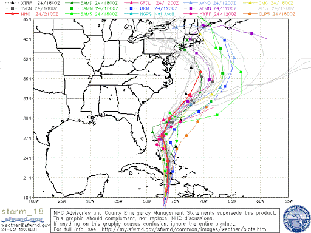
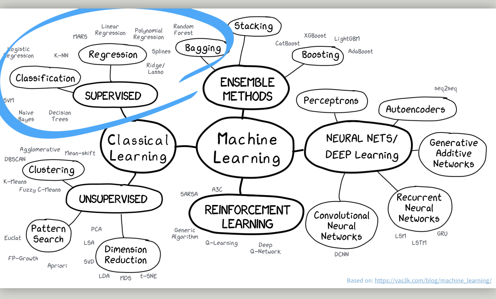
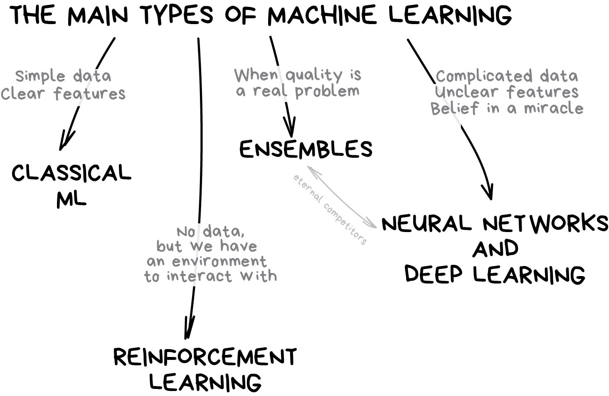
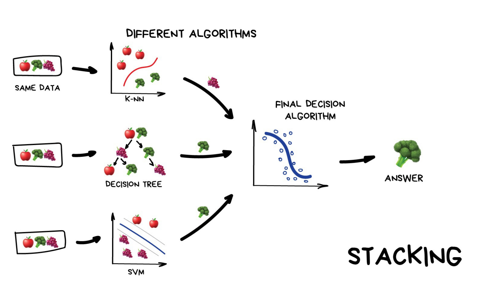
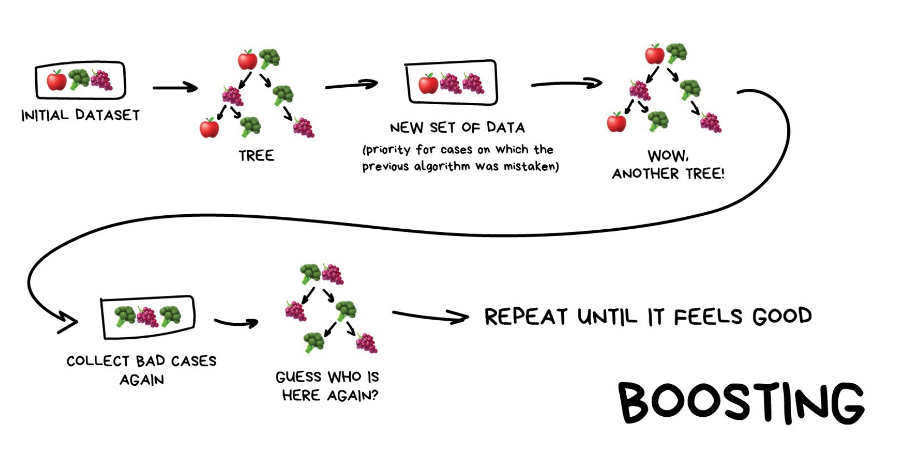
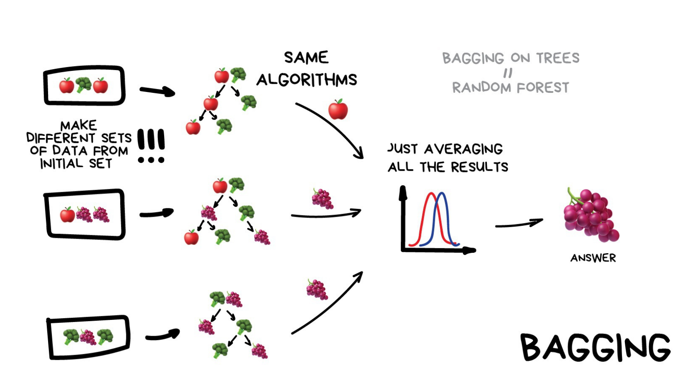
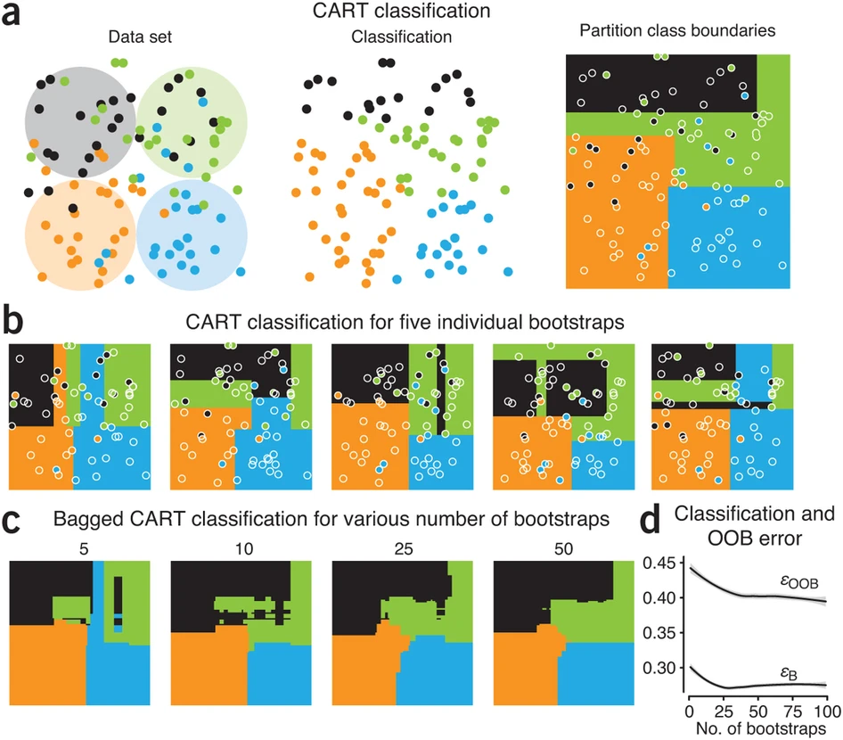
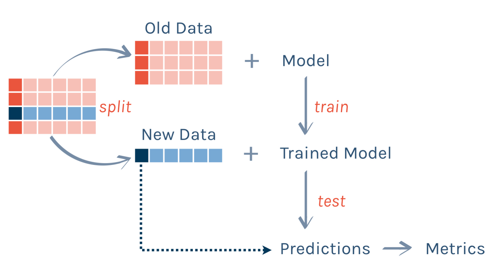

class: inverse, left, bottom

# Biological Statistics II
### Gavin Fay   
<br> __2025-04-15: Lecture 20, Ensemble methods__
<br> [gfay@umassd.edu](gfay@umassd.edu) 
<br> __Acknowledgements:__  [Alison Hill]("https://twitter.com/apreshill") 

<!-- [default, metropolis, metropolis-fonts] -->
<!--    highlightStyle: atelier-lakeside-light -->


```{r setup, include=FALSE}
knitr::opts_chunk$set(echo = TRUE)
knitr::opts_chunk$set(prompt = FALSE)
options(htmltools.dir.version = FALSE)
library(tidymodels)
library(tidyverse)
#library(infer)
#devtools::install_github("gadenbuie/countdown")
library(countdown)
library(patchwork)
```
---


## Ensemble methods

What are ensembles?  

--

_Ensembles_ 
Predictions based on some aggregation of multiple models to produce improved results.  
Idea that can obtain more accurate predictions than a single model would.    




---



---



.footnote[
img from Machine Learning for Everyone <https://vas3k.com/blog/machine_learning/>
]

---

## Approaches

### Voting

* Majority voting  
* Weighted voting  

--

### Averaging

* Simple averaging  
* Weighted averaging  

We've looked at model averaging via AIC.  
i.e. AIC weights  
- only for models that can be compared via AIC  

Here we are combining predictions.  


---

## Ensemble methods

### Stacking

--

### Boosting

--

### Bagging

---

## Stacking - combining by another model



.footnote[
[img from Machine Learning for Everyone]<https://vas3k.com/blog/machine_learning/>
]


---

## Boosting

"convert weak models to strong ones"  

Incrementally build an ensemble by training each model with the same dataset but where the weights of instances are adjusted according to the error of the last prediction.  

e.g. model 2 is fit to the residuals from model 1, etc.  

- forces models to focus on observations that are poorly fit.  
 
Boosting is sequential.  

---

## Boosting



.footnote[
[img from Machine Learning for Everyone]<https://vas3k.com/blog/machine_learning/>
]

---

## Boostrap Aggregating (Bagging)

.pull-left[
Obtain multiple model fits based on boostrapped datasets.  

Recall Bootstrapped dataset:
Dataset of size equal to original, but resampling with replacement.  

Fit (train) model to each data set.  

Obtain model predictions for each boostrap.  

Combine predictions.  

We've done this with LMs and GLMs, but we can also do this with trees.  
]

.pull-right[

]


---

## Bagging



.footnote[
[img from Machine Learning for Everyone]<https://vas3k.com/blog/machine_learning/>
]


---

## Bagging with Classification Trees

```{r out.width="60%", retina = 3, echo= FALSE}

```

.footnote[
Altman, N., Krzywinski, M. Ensemble methods: bagging and random forests. Nat Methods 14, 933–934 (2017). [https://doi.org/10.1038/nmeth.4438](https://doi.org/10.1038/nmeth.4438)
]

---

## Random Forest

Random Forest algorithm uses the bagging technique with some differences.  

Random Forest uses random feature selection, and the base algorithm of it is a decision tree algorithm.  

Bagging results in tree correlation that limits effects of variance reduction

Random forests try to reduce tree correlation by adding more randomness into the tree-growing process.  


random forests perform split-variable randomization where each time a split is to be performed, the search for the split variable is limited to a random subset `mtry` of the original p features. Typical default values are mtry=p/3 (regression) and mtry=√p (classification) but this should be considered a tuning parameter.  

Random forests have become popular because good out-of-box performance.  


---

## Example, regression modeling of beach species richness

Workflow:  



---

## Example, regression modeling of beach species richness

2 models:
linear regression
regression tree

```{r, message=FALSE, comment='hide'}
RIKZ <- read_table2(file = "../data/RIKZ.txt")
RIKZ <- RIKZ %>% mutate(Richness = rowSums(RIKZ[,2:76]>0)) %>% 
  select(Richness, 77:89) %>% 
  mutate(week = as.factor(week),
         Beach = as.factor(Beach))
```

```{r}
library(tidymodels)

set.seed(8675309)
data_split <- initial_split(RIKZ, prop = 0.5)

rikz_train <- training(data_split)
rikz_test  <- testing(data_split)

```

---

background-image: url(figs/parsnip_logo.png)
background-position: 50% 80%
background-size: 20%

## linear model

We use the `parsnip` package from `tidymodels`.   
An advantage is we can fit lots of different types of models with the same workflow.  

--

```{r}
lm_fit <-
  linear_reg() %>%
  set_engine("lm") %>%
  fit(Richness ~ ., data = rikz_train)
```

---

## linear model

We use the `parsnip` package from `tidymodels`.   
An advantage is we can fit lots of different types of models with the same workflow.  


```{r}
lm_fit <-
  linear_reg() %>%
  set_engine("lm") %>%
  fit(Richness ~ ., data = rikz_train)
lm_fit
```


---

## linear model

```{r}
lm_fit <-
  linear_reg() %>%
  set_engine("lm") %>%
  fit(Richness ~ ., data = rikz_train)
```

.pull-left[
```{r, message=FALSE, warning = FALSE}
test_results <- 
  rikz_test %>%
  select(Richness) %>%
  bind_cols(
    predict(lm_fit, new_data = rikz_test)
  )
test_results %>% slice(1:5)
```
]

.pull-right[
```{r, message=FALSE, warning = FALSE}
# summarize performance
test_results %>% metrics(truth = Richness, estimate = .pred) 
```
]

---

## Decision Tree

.pull-left[
```{r}
rt_fit <- decision_tree(mode = "regression") %>% 
  set_engine("rpart") %>%
  fit(Richness ~ ., data = rikz_train)
rt_fit
```
]

--

.pull-right[
```{r, message = FALSE, warning=FALSE}
library(rpart.plot)
rpart.plot(rt_fit$fit)
```
]

---

## Decision Tree

```{r}
test_results <- 
  test_results %>%
  rename(`linear model` = .pred) %>%
  bind_cols(
    predict(rt_fit, new_data = rikz_test) %>% 
      rename(`decision tree` = .pred)
  )
test_results %>% slice(1:3)
```

```{r}
# summarize performance
test_results %>% metrics(truth = Richness, estimate = `decision tree`) 
```


---

## Plotting predictions
```{r, echo = FALSE, out.width = "100%", retina = 3}
test_results %>% 
  gather(model, prediction, -Richness) %>% 
  ggplot(aes(x = prediction, y = Richness)) + 
  geom_abline(col = "blue", lty = 2) + 
  geom_point(alpha = .4) + 
  facet_wrap(~model) + 
  coord_fixed()
```

---

## Bagging

```{r}
rf_defaults <- rand_forest(mode = "regression", mtry = .preds())
rf_defaults
```


---

## Bagging

```{r}
rf_defaults <- rand_forest(mode = "regression", mtry = .preds())
bg_xy_fit <- 
  rf_defaults %>%
  set_engine("ranger", importance = "impurity") %>%
  fit(Richness ~ ., data = rikz_train)
bg_xy_fit
```

---

## Bagging, predictions

```{r}
test_results <- 
  test_results %>%
  bind_cols(
    predict(bg_xy_fit, new_data = rikz_test) %>% 
      rename(`bagging` = .pred)
  )
test_results %>% slice(1:3)
```

```{r}
# summarize performance
test_results %>% metrics(truth = Richness, estimate = bagging) 
```

---

## Random Forest

```{r}
rf_xy_fit <- 
  rand_forest(mode = "regression") %>% 
  set_engine("ranger", importance = "impurity") %>%
  fit(Richness ~ ., data = rikz_train)
rf_xy_fit
```

---

## Random Forest

```{r}
test_results <- 
  test_results %>%
  bind_cols(
    predict(rf_xy_fit, new_data = rikz_test) %>% 
      rename(`random forest` = .pred))
test_results %>% slice(1:3)
```

```{r}
# summarize performance
test_results %>% metrics(truth = Richness, estimate = `random forest`) 
```

---

## plotting predictions
```{r, echo = FALSE, retina = 3, out.width = "80%"}
test_results %>% 
  gather(model, prediction, -Richness) %>% 
  ggplot(aes(x = prediction, y = Richness)) + 
  geom_abline(col = "blue", lty = 2) + 
  geom_point(alpha = .4) + 
  facet_wrap(~model) + 
  coord_fixed()
```

---

## Importance of predictor variables

We see the effect of the random forest - de-emphasizes NAP in tree solutions.  
```{r, echo = FALSE, retina = 3}
p1 <- as_tibble(rf_xy_fit$fit$variable.importance, rownames = "variable") %>% 
  rename(importance = value) %>% 
ggplot() +
  aes(x=reorder(variable,importance), y=importance,fill=importance)+ 
  geom_bar(stat="identity", position="dodge")+ coord_flip()+
  ylab("Variable Importance")+
  xlab("")+
  ggtitle("Random Forest")+
  guides(fill=F)+
  #scale_fill_viridis_c()+
#  scale_fill_gradient(low="red", high="blue")
  NULL

p2 <- as_tibble(bg_xy_fit$fit$variable.importance, rownames = "variable") %>% 
  rename(importance = value) %>% 
ggplot() +
  aes(x=reorder(variable,importance), y=importance,fill=importance)+ 
  geom_bar(stat="identity", position="dodge")+ coord_flip()+
  ylab("Variable Importance")+
  xlab("")+
  ggtitle("Bagging")+
  guides(fill=F)+
  #scale_fill_viridis_c()+
#  scale_fill_gradient(low="red", high="blue")
  NULL
p2 + p1
```


---

## Takeaways

Ensemble methods rely on 'wisdom of the crowd', to (often) produce more accurate predictions with lower variance.  

Rather than averaging or using majority vote, Stacking uses predictions from models as input to another model to produce the ensemble estimate.  

Boosting iterates to try and improve fit for poorly fit observations.  

Bagging is akin to bootstrap methods seen earlier in class.  

'Out-of-bag' error rates (OOB) give an estimate of the test error rate.  

Random Forest extends bagging.  

These methods all have 'tuning' parameters that in many cases can be optimized.   

Ensemble methods can produce accurate predictions but are often much less interpretable than single statistical models.  


---

## Resources

Lots of learning resources on the new [tidymodels]("https://tidymodels.org") website!  

Also lots of resources collated by [Alison Hill]("https://twitter.com/apreshill"):  
[https://alison.rbind.io/post/2019-12-23-learning-to-teach-machines-to-learn/](https://alison.rbind.io/post/2019-12-23-learning-to-teach-machines-to-learn/)


Altman, N., Krzywinski, M. Ensemble methods: bagging and random forests. Nat Methods 14, 933–934 (2017). [https://doi.org/10.1038/nmeth.4438]("https://doi.org/10.1038/nmeth.4438")


R for Statistical Learning (D. Dalpiaz) chap 27  
[https://daviddalpiaz.github.io/r4sl/ensemble-methods.html]("https://daviddalpiaz.github.io/r4sl/ensemble-methods.html")


