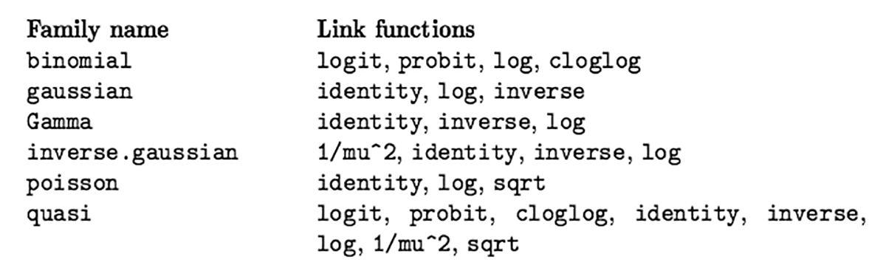

## setup

```{r setup}
library(tidyverse)
library(broom)
```

## setup

```{r}
#first read in the data & create richness variable
RIKZ <- read_table(file = "../data/RIKZ.txt")
RIKZ <- RIKZ |> 
  mutate(Richness = rowSums(RIKZ[,2:76]>0)) |>
  select(Richness, 77:89)
```

## Generalized linear modeling

Recall from lecture: $$\eta = \beta_1 x_1 + \beta_2 x_2 + \dots + \beta_p x_p$$ $$f_Y(y;\mu,\varphi) = \exp\left[\frac{A}{\varphi}{y\lambda(\mu)-\gamma(\lambda(\mu))}+\tau(y,\varphi)\right]$$ $$\mu = m(\eta) \text{,    } \eta = m^{-1}(\mu)=l(\mu)$$

The combination of a response distribution, a link function and other information needed to carry out the modeling exercise is called the *family* of the generalized linear model.



## The `glm()` function

The `R` function to fit a generalized linear model is `glm()` which uses the form:\
`fitted.model <- glm(formula, family=family.generator, data=data.frame)`

Only new piece is the call to 'family.generator'\
Although complex, its use is fairly simple.\
Where there is a choice of link, link can be supplied with the family name as a parameter.

Simple (inefficient) use: The following are equivalent.

```{r prompt=TRUE,comment='',collapse=TRUE,echo=TRUE}
RIKZ_lm1 <- lm(Richness ~ NAP, data = RIKZ)
RIKZ_glm1 <- glm(Richness ~ NAP, family = gaussian, 
                 data = RIKZ)
```

Most of the extraction functions that can be applied to `lm()` can also be used with `glm()`.

## The `glm()` function

```{r prompt=TRUE,comment='',collapse=TRUE,echo=TRUE}
tidy(RIKZ_lm1)
tidy(RIKZ_glm1)
```

## Poisson regression

$$P(X=x) = \frac{e^{-\mu} \mu^x}{x!} \text{,   } \mu_i = e^{\alpha+\beta_1 x_{1,i} + \dots + \beta_j x_{j,i}}$$


## RIKZ example

```{r prompt=TRUE,comment='',collapse=TRUE,echo=TRUE}
#fit the poisson regression model
RIKZ_poisson <- glm(Richness ~ NAP, data = RIKZ, 
                    family = poisson)
```

Note that the default link for the poisson is `log` so we don't have to specify here (see `?family`).

## `summary(RIKZ_poisson)`

```{=tex}
\begingroup
\fontsize{10}{11}\selectfont
```
```{r prompt=TRUE,comment='',collapse=TRUE,echo=FALSE}
summary(RIKZ_poisson)
```

```{=tex}
\endgroup
```
## `broom::augment()`

As with `lm()`, the `augment()` function can be used to obtain the predictions from a fitted model object, and for a new data frame.

```{r prompt=TRUE,comment='',collapse=TRUE,echo=TRUE, eval=FALSE}
newobject <- augment(oldobject, newdata, 
                     type.predict = c("link","response","terms"),
                     se_fit = TRUE)
```

Note: default for `type.predict` is on the scale of the linear predictors. Set to `"response"` to obtain predictions on the scale of the response variable.

## Observed and fitted values for Poisson RIKZ

```{=tex}
\begingroup
\fontsize{10}{11}\selectfont
```
```{r prompt=TRUE,comment='',collapse=TRUE,echo=TRUE,fig.show='hide'}
#create new values for beach height
new_data <- tibble(NAP = seq(-1.5,2.5,length.out=100))
#predict values for response based on new salinity
RIKZ_pois_pred <- augment(RIKZ_poisson,
                    newdata = new_data, 
                    type.predict = "response",
                    se_fit = "TRUE")
#plot
ggplot(RIKZ, aes(x=NAP, y= Richness)) +
         geom_point() +
         geom_line(data = RIKZ_pois_pred,
                   aes(x=NAP, y = .fitted),
                   col = "blue") +
         labs(y = "Richness", x = "NAP") +
         ylim(0,25) + xlim(-1.5,2.5)
```

```{=tex}
\endgroup
```

------------------------------------------------------------------------

```{r prompt=TRUE,comment='',collapse=TRUE,echo=FALSE,results='hide'}
#create new values for beach height
new_data <- tibble(NAP = seq(-1.5,2.5,length.out=100))
#predict values for response based on new salinity
RIKZ_pois_pred <- augment(RIKZ_poisson,
                    newdata = new_data, 
                    type.predict = "response",
                    se_fit = "TRUE")
#plot
ggplot(RIKZ, aes(x=NAP, y= Richness)) +
         geom_point() +
         geom_line(data = RIKZ_pois_pred,
                   aes(x=NAP, y = .fitted),
                   col = "blue") +
         labs(y = "Richness", x = "NAP") +
         ylim(0,25) + xlim(-1.5,2.5)
```

## fitting the GLM in the ggplot call

```{r prompt=TRUE,comment='',collapse=TRUE,echo=TRUE}
ggplot(RIKZ,aes(NAP,Richness)) +
  geom_point() +
  geom_smooth(method = "glm", 
    method.args = list(family = poisson), se = TRUE)            
```

## Quasi-Poisson

```{r prompt=TRUE,comment='',collapse=TRUE,echo=TRUE}
RIKZ_quasip_1 <- glm(Richness ~ NAP, 
                     family = quasipoisson,
                     data = RIKZ)
summary(RIKZ_quasip_1)
```

## Full Poisson Model

```{r prompt=TRUE,comment='',collapse=TRUE,echo=TRUE}
RIKZ_pois_full <- glm(Richness ~ NAP + factor(week) +
                      factor(exposure),
                      data = RIKZ,
                      family = poisson)
summary(RIKZ_pois_full)
```

## Drop Exposure?

```{r prompt=TRUE,comment='',collapse=TRUE,echo=TRUE}
drop1(RIKZ_pois_full, test = "Chisq")
```

