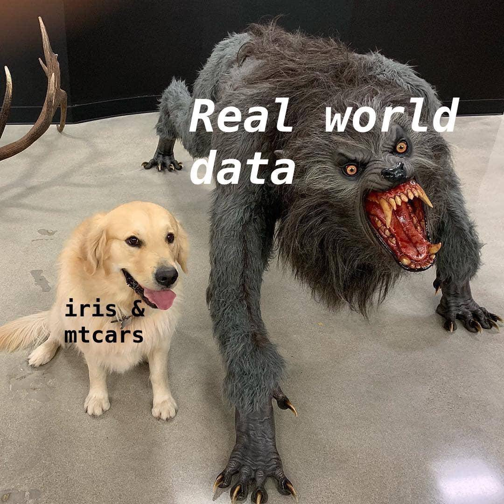
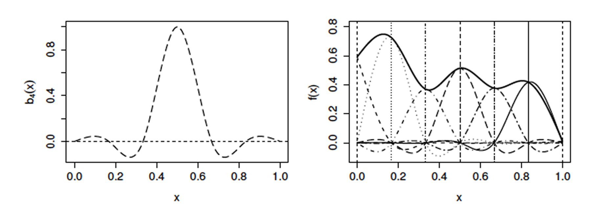
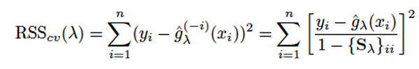
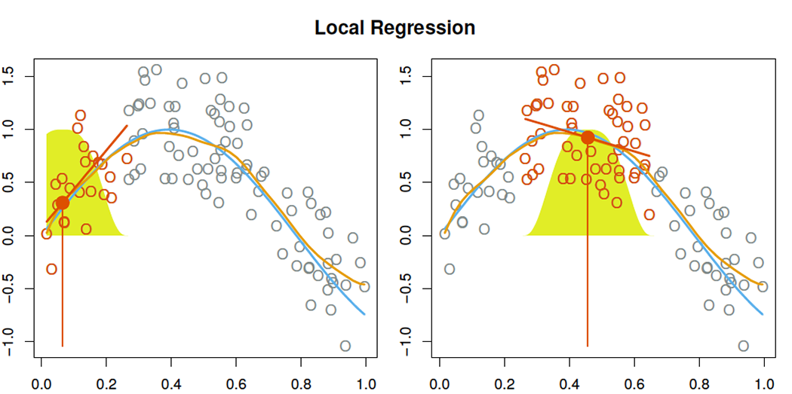
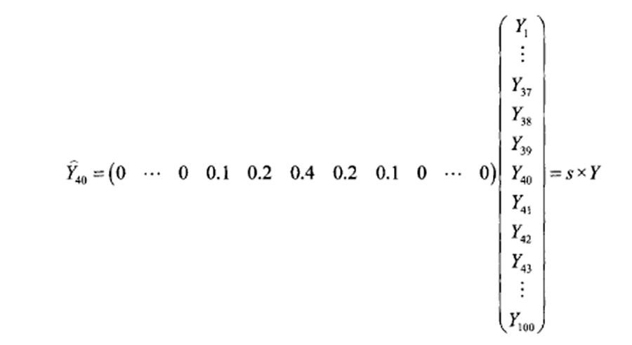

```{r setup, include=FALSE}
library(ISLR)
attach(Wage)
```

## Objectives

-   Discuss need for nonlinear models
-   Review approaches for nonlinearity in linear models
-   Polynomials
-   Regression splines
-   Smoothing splines

## Linear regression

$$\mathbf{Y} = \mathbf{X}\boldsymbol{\beta} + \boldsymbol{\epsilon}$$

-   Limitations in terms of predictive power\
-   Linear assumption almost always an approximation.\
    (sometimes a poor one)

------------------------------------------------------------------------



## Linear regression

$$\mathbf{Y} = \mathbf{X}\boldsymbol{\beta} + \boldsymbol{\epsilon}$$

-   Limitations in terms of predictive power\
-   Linear assumption almost always an approximation.\
    (sometimes a poor one)

Today's question:\
- Can we relax the linear assumptions but retain interpretability?

------------------------------------------------------------------------

```{r prompt=TRUE,comment='',collapse=TRUE,echo=FALSE,results='hide',fig.width=4.5,fig.height=4.5,warning=FALSE}

# Polynomial Regression and Step Functions

fit=lm(wage~poly(age,4),data=Wage)
coef(summary(fit))
fit2=lm(wage~poly(age,4,raw=T),data=Wage)
coef(summary(fit2))
fit2a=lm(wage~age+I(age^2)+I(age^3)+I(age^4),data=Wage)
coef(fit2a)
fit2b=lm(wage~cbind(age,age^2,age^3,age^4),data=Wage)
agelims=range(age)
age.grid=seq(from=agelims[1],to=agelims[2])
preds=predict(fit,newdata=list(age=age.grid),se=TRUE)
se.bands=cbind(preds$fit+2*preds$se.fit,preds$fit-2*preds$se.fit)
par(mfrow=c(1,1),mar=c(4.5,4.5,1,1),oma=c(0,0,4,0))
plot(age,wage,xlim=agelims,cex=.5,col="darkgrey")
```

## Options for nonlinearity

```{=tex}
\begingroup
\fontsize{10}{11}\selectfont
```
**Polynomial regression**\
- Raise original predictors to powers, e.g. $x^{2} \text{, } x^{3} \text{, etc.}$\
**Step functions**\
- Divide range of $X$ into $K$ regions, to create a categorical variable.\
- Piecewise constant function\
**Regression splines**\
- Extension of previous two, $K$ regions,\
- Fit polynomial to the data in each region - Constraints so pieces join smoothly at region boundaries\
**Smoothing splines**\
- Minimize RSS subject to a smoothness penalty\
**Local regression**\
- Regions are allowed to overlap (e.g. LOESS)\
**Generalized Additive Models**\
- extend all of the above\
- deal with multiple predictors\
**True nonlinear models**\
- The above all consider linear functions\
- fit nonlinear functions of data e.g. via nls, maximum likelihood\
\endgroup

## Polynomial regression

Add additional predictors that are some degree polynomials of `X`.

$$y_{i} = \alpha + \beta_1 x_i + \beta_2 x_{i}^2 + \beta_3 x_{i}^3 + \epsilon_i$$

Use usual `lm()` machinery.

```{r prompt=TRUE,comment='',collapse=TRUE,eval=FALSE}
fit=lm(wage~poly(age,4),data=Wage)
fit2a=lm(wage~age+I(age^2)+I(age^3)+I(age^4),data=Wage)
fit2b=lm(wage~cbind(age,age^2,age^3,age^4),data=Wage)
```

------------------------------------------------------------------------

```{=tex}
\begingroup
\fontsize{10}{11}\selectfont
```
```{r prompt=TRUE,comment='',collapse=TRUE}
fit.1=lm(wage~age,data=Wage)
fit.2=lm(wage~poly(age,2),data=Wage)
fit.3=lm(wage~poly(age,3),data=Wage)
fit.4=lm(wage~poly(age,4),data=Wage)
fit.5=lm(wage~poly(age,5),data=Wage)
anova(fit.1,fit.2,fit.3,fit.4,fit.5)
```

```{=tex}
\endgroup
```

------------------------------------------------------------------------

```{r prompt=TRUE,comment='',collapse=TRUE,echo=FALSE,results='hide',fig.width=4,fig.height=2.542,warning=FALSE}
par(mfrow=c(1,2),mar=c(2,2,1,1),oma=c(0,0,2,0))
plot(age,wage,xlim=agelims,cex=.5,col="darkgrey",cex.lab=0.5,cex.main=0.5,cex.axis=0.5)
title("Degree-4 Polynomial",outer=T)
lines(age.grid,preds$fit,lwd=2,col="blue")
matlines(age.grid,se.bands,lwd=1,col="blue",lty=3)
fit=glm(I(wage>250)~poly(age,4),data=Wage,family=binomial)
preds=predict(fit,newdata=list(age=age.grid),se=T)
pfit=exp(preds$fit)/(1+exp(preds$fit))
se.bands.logit = cbind(preds$fit+2*preds$se.fit, preds$fit-2*preds$se.fit)
se.bands = exp(se.bands.logit)/(1+exp(se.bands.logit))
preds=predict(fit,newdata=list(age=age.grid),type="response",se=T)
plot(age,I(wage>250),xlim=agelims,type="n",ylim=c(0,.2),cex.lab=0.5,cex.main=0.5,cex.axis=0.5)
points(jitter(age), I((wage>250)/5),cex=.5,pch="|",col="darkgrey")
lines(age.grid,pfit,lwd=2, col="blue")
matlines(age.grid,se.bands,lwd=1,col="blue",lty=3)
```

(Very) high order polynomials sometimes necessary to approximate functions and these are often still not sensible.

## Step function

Polynomial imposes 'global' structure on the function of $X$.

Step functions convert continuous variable to 'ordered categorical' variables.

Creates a piece-wise constant function.

$$y_{i} = \alpha + \beta_1 \mathbf{I}_{1}(x_i)  + \beta_2 \mathbf{I}_{2}(x_i) + \beta_3 \mathbf{I}_{3}(x_i) + \epsilon_i$$

where $\mathbf{I}_{k}$ is an indicator function returning 1 if $x_i$ is within region $k$ and 0 otherwise.

------------------------------------------------------------------------

```{r prompt=TRUE,comment='',collapse=TRUE,echo=FALSE,results='hide',fig.width=4,fig.height=2.542,warning=FALSE}
fit=lm(wage~cut(age,4),data=Wage)
preds=predict(fit,newdata=list(age=age.grid),se=TRUE)
se.bands=cbind(preds$fit+2*preds$se.fit,preds$fit-2*preds$se.fit)
par(mfrow=c(1,2),mar=c(2,2,1,1),oma=c(0,0,2,0))
plot(age,wage,xlim=agelims,cex=.5,col="darkgrey",cex.lab=0.5,cex.main=0.5,cex.axis=0.5)
title("Step Function (K=4)",outer=T)
lines(age.grid,preds$fit,lwd=2,col="blue")
matlines(age.grid,se.bands,lwd=1,col="blue",lty=3)
fit=glm(I(wage>250)~cut(age,4),data=Wage,family=binomial)
preds=predict(fit,newdata=list(age=age.grid),se=T)
pfit=exp(preds$fit)/(1+exp(preds$fit))
se.bands.logit = cbind(preds$fit+2*preds$se.fit, preds$fit-2*preds$se.fit)
se.bands = exp(se.bands.logit)/(1+exp(se.bands.logit))
preds=predict(fit,newdata=list(age=age.grid),type="response",se=T)
plot(age,I(wage>250),xlim=agelims,type="n",ylim=c(0,.2),cex.lab=0.5,cex.main=0.5,cex.axis=0.5)
points(jitter(age), I((wage>250)/5),cex=.5,pch="|",col="darkgrey")
lines(age.grid,pfit,lwd=2, col="blue")
matlines(age.grid,se.bands,lwd=1,col="blue",lty=3)
```

Piece-wise constant functions miss the action.\
- fail to capture increasing wage with age.

## Basis Functions

Polynomial and Step functions are special cases of basis function approach:

A family of functions or transformations that can be applied to a variable $X$.

e.g. $b_1(X) \text{, } b_2(X) \text{, } b_3(X) \text{, etc.}$

We can view predictions from a regression as a weighted sum of basis functions.

All inference tools for linear models are therefore available.

Basis functions must be chosen ahead of time (basis functions are known)\
- other choices for constructing basis functions include wavelets & Fourier series.

Regression splines are a common choice for basis function.

## Regression splines

Fit piecewise polynomials.\
Divide data into $K+1$ regions using $K$ *knots*\
Separate polynomial fitted to the data in each region.

e.g. for a function with a single knot at $x=c$,

$$ \hat{y}_i = \begin{cases} \text{ polynomial 1 if } x_i < c \\
\text{ polynomial 2 if } x_i \geq c \end{cases}$$

Immediate problem: functions are discontinuous and look silly!

------------------------------------------------------------------------

```{r prompt=TRUE,comment='',collapse=TRUE,echo=FALSE,results='hide',fig.width=4,fig.height=2.542,warning=FALSE}
fit1=lm(wage~poly(age,3),data=Wage[Wage$age<50,])
agelims=range(age[Wage$age<50])
age.grid=seq(from=agelims[1],to=agelims[2])
preds=predict(fit1,newdata=list(age=age.grid),se=TRUE)
se.bands=cbind(preds$fit+2*preds$se.fit,preds$fit-2*preds$se.fit)
par(mfrow=c(1,1),mar=c(2,2,1,1),oma=c(0,0,2,0))
plot(age,wage,xlim=range(age),cex=.5,col="darkgrey",cex.lab=0.5,cex.main=0.5,cex.axis=0.5)
title("piece-wise d-3 polynomial, knot at age=50",outer=T,cex=0.5)
lines(age.grid,preds$fit,lwd=2,col="blue")
matlines(age.grid,se.bands,lwd=1,col="blue",lty=3)
fit2=lm(wage~poly(age,3),data=Wage[Wage$age>=50,])
agelims=range(age[Wage$age>=50])
age.grid=seq(from=agelims[1],to=agelims[2])
preds=predict(fit2,newdata=list(age=age.grid),se=TRUE)
se.bands=cbind(preds$fit+2*preds$se.fit,preds$fit-2*preds$se.fit)
lines(age.grid,preds$fit,lwd=2,col="blue")
matlines(age.grid,se.bands,lwd=1,col="blue",lty=3)
```

## Constraints and splines

Add constraints:

First fitted curve must be continuous at $age=50$.

1st & 2nd derivatives are continuous at $age=50$.

Cubic spline has $4+K$ degrees of freedom ($K$ is the number of *knots*)

For a degree-*d* spline:\
- piecewise degree-*d* polynomial with continuity in derivatives up to $d-1$ at each knot.

------------------------------------------------------------------------


## Spline basis representation

How can we fit regression splines with constraints?\
Use basis functions. e.g. for a cubic spline with $K$ knots:\
$$y_i = \beta_0 + \beta_1 b_1(x_i) + \beta_2 b_2(x_i) + \dots + \beta_{K+3} b_{K+3}(x_i) + \epsilon_i$$

There are many ways to represent the basis functions for regression splines.

A common one is to add one *truncated power basis* per knot

$$h(x,\xi) =
  \begin{cases}
    (x-\xi)^3 & \quad \text{if } x > \xi\\
    0  & \quad \text{if } otherwise,\\
  \end{cases}$$

```{r prompt=TRUE,comment='',collapse=TRUE,eval=FALSE}
Wage$trunc50 <- (Wage$age-50)^3
Wage$trunc50[Wage$age<50] <- 0
fit <- lm(wage ~ poly(age,3) + trunc50,data=Wage)
```

------------------------------------------------------------------------

```{r prompt=TRUE,comment='',collapse=TRUE,echo=FALSE,results='hide',fig.width=4,fig.height=2.542,warning=FALSE}
Wage$trunc50 <- (Wage$age-50)^3
Wage$trunc50[Wage$age<50] <- 0
fit <- lm(wage ~ poly(age,3) + trunc50,data=Wage)
agelims <- range(age)
age.grid <- seq(from=agelims[1],to=agelims[2])
trunc50.grid <- ifelse(age.grid>50,(age.grid-50)^3,0)
preds=predict(fit,newdata=list(age=age.grid,trunc50=trunc50.grid),se=TRUE)
se.bands=cbind(preds$fit+2*preds$se.fit,preds$fit-2*preds$se.fit)
par(mfrow=c(1,1),mar=c(2,2,1,1),oma=c(0,0,2,0))
plot(age,wage,xlim=range(age),cex=.5,col="darkgrey",cex.lab=0.5,cex.main=0.5,cex.axis=0.5)
title("cubic regression spline, 1 knot at age=50",outer=T,cex=0.5)
lines(age.grid,preds$fit,lwd=2,col="blue")
matlines(age.grid,se.bands,lwd=1,col="blue",lty=3)
```

## Spline basis representation

```{=tex}
\begingroup
\fontsize{10}{11}\selectfont
```
Truncated power basis can be unstable.

There are other ways of defining basis functions for cubic regression splines.

Some of these include paramterizations in terms of the values at the knots.\
\endgroup



```{=tex}
\begingroup
\fontsize{10}{11}\selectfont
```
(Figure from Wood, 2006)

Others include:\
- cyclic cubic regression splines\
- B-splines (basis functions are strictly local)\
- P-splines (for equally spaced knots)\
- Thin plate splines (Duchon 1977), are an example of a smoothing spline.

```{=tex}
\endgroup
```
## Natural splines

Splines can have high variance, particularly at the data extremes.

*Natural splines* have additional boundary constraints:\
- the function is required to be linear outside the smallest/largest knots.

```{r prompt=TRUE,comment='',collapse=TRUE,eval=FALSE}
fit <- lm(wage ~ ns(age, knots=c(25, 40, 60)), 
          data=Wage)
```

------------------------------------------------------------------------


## Number & Location of knots

Might want to be flexible\
- e.g. place more knots in region where suspect function most likely to be changing

More commonly, place knots in uniform fashion\
- uniformly spaced over range of data\
- uniform quantiles of data

In function calls:\
- either request the degrees of freedom (e.g. $6\text{df} \implies 3$ knots)\
- or specify the knot locations.

```{=tex}
\begingroup
\fontsize{10}{11}\selectfont
```
```{r prompt=TRUE,comment='',collapse=TRUE,eval=TRUE,R.options=library(splines)}
fit <- lm(wage ~ bs(age, knots=c(25, 40, 60)), data=Wage)
fit2 <- lm(wage ~ bs(age, df=6), data=Wage)
attr(bs(age,df=6),"knots")
```

Note that if `df=` is chosen then knots are spaced at uniform quantiles of the data.\
\endgroup

## Number & Location of knots

Run for different numbers of knots, look at which produces the best curve.

Cross-validation more objective.\
1. remove $k$% of the data. ($k$-fold cv)\
2. fit spline to remaining data\
3. Predict the left-out data, compute RSS (or other measure of fit)\
4. Repeat 1-3 until all data used, compute total RSS\
5. Repeat 1-4 using different \# of knots

**Splines v polynomials:**\
Polynomials require high degree to produce flexible fits.\
Splines, increase \# knots but keep degree fixed.\
- generally produce more stable estimates.\
- also allow knots to be placed where function appears to be changing most rapidly.

## Smoothing splines

```{=tex}
\begingroup
\fontsize{10}{11}\selectfont
```
Related to regression splines but instead have $n$ knots, 1 for each data point.

In general, we want $\sum_{i}(y_i-g(x_i))^2$ to be small.

Could make $g()$ ***so*** flexible that it interpolates all the $y_i$.

Find function $g$ that minimizes

$$\displaystyle\sum_{i=1}^{n}(y_i-g(x_i))^2 + \lambda \int\limits_0^\infty g^{''}(t)^{2}dt$$

'loss' plus 'penalty'

The tuning parameter $\lambda$ controls the bias-variance tradeoff of smoothing spline.

```{=tex}
\endgroup
```
## Lambda controls the smoothness

```{r prompt=TRUE,comment='',collapse=TRUE,echo=FALSE,results='hide',fig.width=4,fig.height=2.542,warning=FALSE}
par(mfrow=c(1,3),mar=c(2,2,1,1),oma=c(0,0,2,0))
mydat <- Wage[sample(1:nrow(Wage),100,replace=FALSE),]
agelims <- range(mydat$age)
plot(mydat$age,mydat$wage,xlim=agelims,cex=.5,col="darkgrey",pch=16)
title(expression(paste(lambda," = 0")))
fit <- smooth.spline(mydat$age,mydat$wage,df=length(unique(mydat$age)))
#fit2 <- smooth.spline(mydat$age,mydat$wage,df=0)
fit2 <- lm(wage~age,data=mydat)
fit3 <- smooth.spline(mydat$age,mydat$wage,df=6)
lines(fit,col="red",lwd=2)
plot(mydat$age,mydat$wage,xlim=agelims,cex=.5,col="darkgrey",pch=16)
new.age <- seq(20,80,1)
lines(20:80,predict(fit2,newdata=list(age=new.age)),col="blue",lwd=2)
title(expression(paste(lambda," = ",infinity)))
plot(mydat$age,mydat$wage,xlim=agelims,cex=.5,col="darkgrey",pch=16)
lines(fit3,col="black",lwd=2)
title(expression(paste("intermediate ",lambda)))
```

*(Kenny G has a high* $\lambda$)

## Choosing $\lambda$

If $g()$ is a piece-wise cubic polynomial with knots at $x_1\text{, }x_2\text{, }\dots\text{, }x_n$, with continuous 1st & 2nd derivatives at each knot, then it is a 'shrunken' version of a natural cubic spline.

($\lambda$ controls the shrinkage)

As $\begin{matrix} \lambda & 0 & \to & \infty \\ df & n & \to & 2 \end{matrix}$

Effective degrees of freedom\
$\text{df}_\lambda = \displaystyle\sum_{i=1}^{n}{S_\lambda}_ii$ (sum of diagonal)

Use cross-validation to choose the $\lambda$ that minimizes the cumulative cross-validated RSS.



------------------------------------------------------------------------


## Local regression

Fit at a given point computed using only neighboring data.

A new weighted least squares regression at each point.



LOESS smooth probably most common.\
(tri-cube weight function)

## Local regression

Basis functions include the weights assigned to neighboring data points.

e.g. 

Most important choice is the *span*, which controls the size of the neighborhood and therefore the wiggliness.

------------------------------------------------------------------------

```{r prompt=TRUE,comment='',collapse=TRUE,echo=FALSE,results='hide',fig.width=4,fig.height=4,warning=FALSE}
par(mfrow=c(1,1),mar=c(2,2,1,1),oma=c(0,0,2,0))
plot(age,wage,xlim=agelims,cex=.5,col="darkgrey")
title("Local Regression",cex=0.5)
fit=loess(wage~age,span=.2,data=Wage)
fit2=loess(wage~age,span=.5,data=Wage)
lines(age.grid,predict(fit,data.frame(age=age.grid)),col="red",lwd=2)
lines(age.grid,predict(fit2,data.frame(age=age.grid)),col="blue",lwd=2)
legend("topright",legend=c("Span=0.2","Span=0.5"),col=c("red","blue"),lty=1,lwd=2,cex=.8)
```

## Generalized Additive Modeling

(Next week)

Uses the methods today as building blocks for fitting an additive model.

## Additional Recommended Reading

Wood, S., 2006. Generalized additive models: an introduction with R. CRC press.\
(today's material Chapters 3 & 4.1)

Hastie, T.J. and Tibshirani, R.J., 1990. Generalized additive models (Vol. 43). CRC Press.

Wahba, G. (1990). Spline Models for Observational Data. Philadelphia: Society for Industrial and Applied Mathematics.

